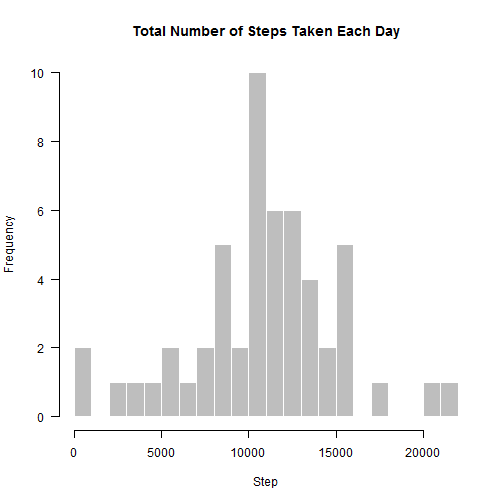
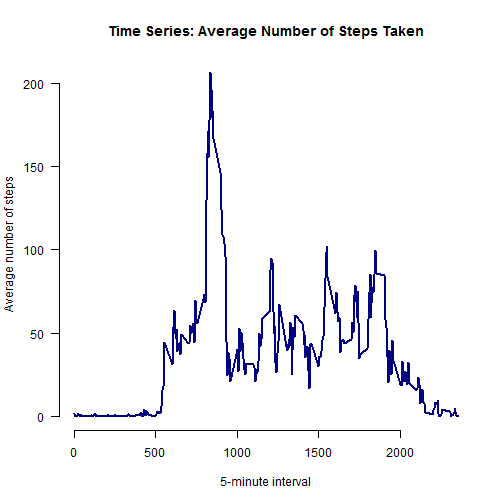
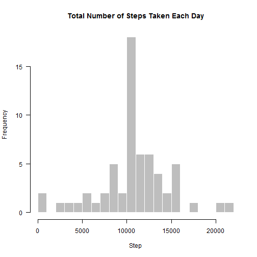
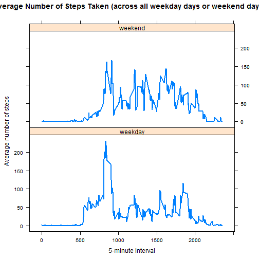

Reproducible Research: Peer Assessment 1

Loading and preprocessing the data

1. Load the data (i.e. read.csv())


```r
#load the data
activityData <- read.csv("activity.csv")
head(activityData)
```

```
##   steps       date interval
## 1    NA 2012-10-01        0
## 2    NA 2012-10-01        5
## 3    NA 2012-10-01       10
## 4    NA 2012-10-01       15
## 5    NA 2012-10-01       20
## 6    NA 2012-10-01       25
```

```r
str(activityData)
```

```
## 'data.frame':	17568 obs. of  3 variables:
##  $ steps   : int  NA NA NA NA NA NA NA NA NA NA ...
##  $ date    : Factor w/ 61 levels "2012-10-01","2012-10-02",..: 1 1 1 1 1 1 1 1 1 1 ...
##  $ interval: int  0 5 10 15 20 25 30 35 40 45 ...
```

2. Process/transform the data (if necessary) into a format suitable for your analysis


```r
#Transform date to the required format
activityData$date <- as.Date(activityData$date,format="%Y-%m-%d")
```
What is mean total number of steps taken per day?

1. Calculate the total number of steps taken per day.


```r
#steps taken per day
total_step <- aggregate(steps ~ date, data = activityData, sum, na.rm = TRUE)
head(total_step)
```

```
##         date steps
## 1 2012-10-02   126
## 2 2012-10-03 11352
## 3 2012-10-04 12116
## 4 2012-10-05 13294
## 5 2012-10-06 15420
## 6 2012-10-07 11015
```

2. Make a histogram of the total number of steps taken each day

 

Calculate and report the mean and median of the total number of steps taken per day.


```r
#mean
mean(total_step$steps)
```

```
## [1] 10766.19
```

```r
#median
median(total_step$steps)
```

```
## [1] 10765
```


What is the average daily activity pattern?


1.Make a time series plot (i.e. type = "l") of the 5-minute interval (x-axis) and the average number of steps taken, averaged across all days (y-axis).

 

2. Which 5-minute interval, on average across all the days in the dataset, contains the maximum number of steps?


```r
avg_step$interval[which.max(avg_step$steps)]
```

```
## [1] 835
```

Hence, The 835-th 5-minute interval contains the maximum number of steps.

Imputing missing values

Note that there are a number of days/intervals where there are missing values (coded as NA). The presence of missing days may introduce bias into some calculations or summaries of the data.

1. Calculate and report the total number of missing values in the dataset (i.e. the total number of rows with NAs).


```r
sum(is.na(activityData))
```

```
## [1] 2304
```
There are 2304 missing values in the dataset.

2. Devise a strategy for filling in all of the missing values in the dataset. The strategy does not need to be sophisticated. For example, you could use the mean/median for that day, or the mean for that 5-minute interval, etc.

3. Create a new dataset that is equal to the original dataset but with the missing data filled in.
Here I use the mean of 5-minute interval to fill in the values of the missing values.


```r
imp <- activityData # new dataset called imp
for (i in avg_step$interval) {
    imp[imp$interval == i & is.na(imp$steps), ]$steps <- 
        avg_step$steps[avg_step$interval == i]
}
head(imp) # no NAs
```

```
##       steps       date interval
## 1 1.7169811 2012-10-01        0
## 2 0.3396226 2012-10-01        5
## 3 0.1320755 2012-10-01       10
## 4 0.1509434 2012-10-01       15
## 5 0.0754717 2012-10-01       20
## 6 2.0943396 2012-10-01       25
```

```r
sum(is.na(imp)) # should be 0
```

```
## [1] 0
```

4. Make a histogram of the total number of steps taken each day and Calculate and report the mean and median total number of steps taken per day. Do these values differ from the estimates from the first part of the assignment? What is the impact of imputing missing data on the estimates of the total daily number of steps?

 
Calculate and report the mean and median imp data


```r
#mean
mean(stepsByDayImp)
```

```
## [1] 10766.19
```

```r
#median
median(stepsByDayImp)
```

```
## [1] 10766.19
```

The mean is the same as the mean from the first part of the assignment, but the median is not, although their values are close. Imputing missing data using the average of the 5-minute interval results in more data points equal to the mean and smaller variation of the distribution. Since many data points have the same values as the mean, the median is much likely to be the same as the mean as well.

Panel plot comparing the average number of steps taken per 5-minute interval across weekdays and weekends

For this part the weekdays() function may be of some help here. Use the dataset with the filled-in missing values for this part.

1. Create a new factor variable in the dataset with two levels – “weekday” and “weekend” indicating whether a given date is a weekday or weekend day.


```r
imp$day <- weekdays(imp$date)
imp$week <- ""
imp[imp$day == "Saturday" | imp$day == "Sunday", ]$week <- "weekend"
imp[!(imp$day == "Saturday" | imp$day == "Sunday"), ]$week <- "weekday"
imp$week <- factor(imp$week)
```

2. Make a panel plot containing a time series plot (i.e. type = "l") of the 5-minute interval (x-axis) and the average number of steps taken, averaged across all weekday days or weekend days (y-axis). See the README file in the GitHub repository to see an example of what this plot should look like using simulated data.


```r
avg_step_imp <- aggregate(steps ~ interval + week, data = imp, mean)
library(lattice)
xyplot(steps ~ interval | week, data = avg_step_imp, type = "l", lwd = 2,
       layout = c(1, 2), 
       xlab = "5-minute interval", 
       ylab = "Average number of steps",
       main = "Average Number of Steps Taken (across all weekday days or weekend days)")
```

 
